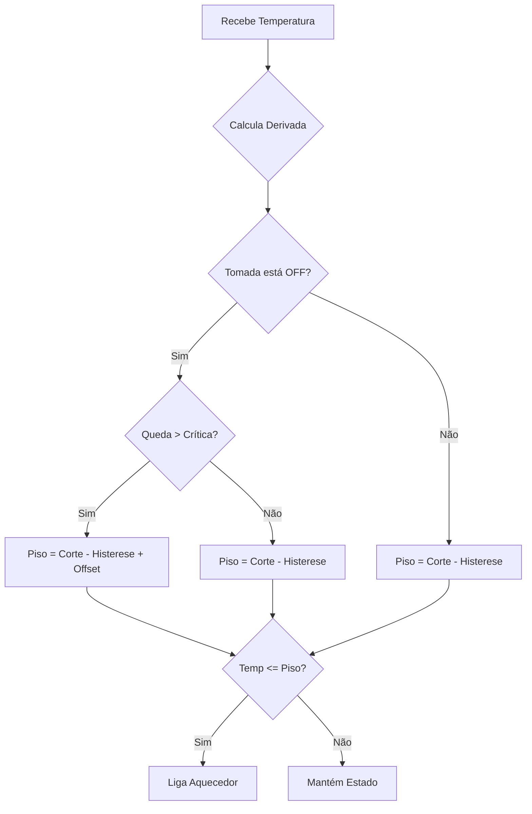

# 🔄 ROO CODE CONTEXT HANDOFF

### [USER]
veja arquivo server.py dentro do diretório atual, eu quero que voce planeje o cálculo da derivada da temperatura, como se trata de um aquecedor dentro da geladeira, quero contrapor uma queda mais acelerada quando o device estiver off (relay em high), devido ao compressor ligado, e se for o caso, subir o "piso" da histerese temporariamente. Faz sentido? Porque se esperarmos dar temperatura - histerese, a chance de eu demorar pra recuperar são altas.

⏰ *Time: 2026-04-22T18:40:15.646Z*

### [ASSISTANT]
*🔧 Tool Call: read_file*
```json
{
  "path": "server.py",
  "mode": "slice",
  "offset": 1,
  "limit": 2000,
  "indentation": {
    "anchor_line": 1,
    "max_levels": 0,
    "max_lines": 2000,
    "include_siblings": false,
    "include_header": true
  }
}
```

### [TOOL]
File: server.py
  1 | import os
  2 | import datetime
  3 | import uvicorn
  4 | import asyncio
  5 | import pytz
  6 | import psycopg2
  7 | from fastapi import FastAPI, Request, BackgroundTasks
  8 | from fastapi.responses import HTMLResponse
  9 | from pydantic import BaseModel
 10 | from typing import List, Optional
 11 | 
 12 | app = FastAPI()
 13 | 
 14 | # --- BANCO DE DADOS (Supabase/PostgreSQL) ---
 15 | DATABASE_URL = os.getenv("DATABASE_URL")
 16 | 
 17 | # --- ESTADO DA TOMADA (Proxy Local) ---
 18 | tomadaStatus: str = "off"
 19 | ultimaLeituraTimestamp: Optional[datetime.datetime] = None

... ✂️ [Tool output truncated: 541 lines hidden for brevity] ✂️ ...

561 |             else:
562 |                 temp_dht.append(valor)
563 |                 temp_ds.append(None)
564 |                 hum_dht.append(None)
565 |         else:
566 |             hum_dht.append(valor)
567 |             temp_ds.append(None)
568 |             temp_dht.append(None)
569 | 
570 |     return {
571 |         "labels": labels,
572 |         "temp_ds": temp_ds,
573 |         "temp_dht": temp_dht,
574 |         "hum_dht": hum_dht
575 |     }
576 | 
577 | if __name__ == "__main__":
578 |     # O Render define a porta automaticamente na variável PORT
579 |     porta = int(os.getenv("PORT", 5000))
580 |     uvicorn.run(app, host="0.0.0.0", port=porta)

### [USER]
⏰ *Time: 2026-04-22T18:40:21.613Z*

### [ASSISTANT]
I've analyzed your [`server.py`](server.py) and the logic makes perfect sense. In thermal systems with high inertia (like a heater inside a fridge), waiting for the lower limit of the hysteresis while the compressor is actively pulling the temperature down often results in a significant "undershoot" because the heater takes time to overcome the cooling trend.

To implement this "anticipatory" logic, I'll need to track the rate of change (derivative) and adjust the activation threshold dynamically.

### Proposed Logic

1.  **Derivative Calculation**: $\frac{\Delta Temp}{\Delta Time}$ (e.g., °C per minute).
2.  **Dynamic Floor**: If the heater is `off` and the derivative is strongly negative (dropping fast), we raise the activation point from `TEMP_CORTE - HISTERESE` to a higher value.
3.  **State Persistence**: We need to store the last temperature and timestamp to calculate the difference.

### Clarifying Questions

Before I create the detailed plan, could you clarify a few points?

1.  **Reading Frequency**: Approximately how often does the ESP32 send temperature updates? (e.g., every 30 seconds, every minute?) This helps define the derivative window.
2.  **Critical Drop Rate**: Do you have an idea of what a "fast drop" looks like in your setup? (e.g., -0.5°C/min).
3.  **Floor Adjustment**: When a fast drop is detected, how much would you like to raise the "floor"? A fixed value (e.g., +0.5°C) or something proportional to the speed of the drop?
4.  **Relay Logic**: Just to confirm, in your code `tomadaStatus = "off"` means the heater is not working (Relay High), correct?

### Preliminary Plan

I will structure the todo list around these steps:

- [ ] Define global variables for `ultima_temperatura` and `derivada_atual`.
- [ ] Define constants for `DERIVADA_QUEDA_CRITICA` and `OFFSET_PISO_DINAMICO`.
- [ ] Update [`rota_temperatura`](server.py:161) to calculate the derivative on every pulse.
- [ ] Implement the conditional logic to calculate `piso_atual` (either standard or raised).
- [ ] Add logging to track when the "Anticipatory Trigger" is active.

How does this approach sound to you?

*🔧 Tool Call: ask_followup_question*
```json
{
  "question": "Qual a frequência das leituras e qual seria um valor de queda 'acelerada' para você?",
  "follow_up": [
    {
      "mode": "architect",
      "text": "As leituras chegam a cada 30 segundos. Uma queda de -0.2°C/min é rápida. Suba o piso em 0.5°C."
    },
    {
      "mode": "architect",
      "text": "As leituras são a cada 1 minuto. Se cair mais de 0.1°C por leitura, suba o piso em 1.0°C."
    },
    {
      "text": "Ainda não sei os valores, vamos criar as variáveis e eu ajusto depois.",
      "mode": "architect"
    }
  ]
}
```

### [TOOL]
Ainda não sei os valores, vamos criar as variáveis e eu ajusto depois.

### [USER]
⏰ *Time: 2026-04-22T18:52:37.391Z*

### [ASSISTANT]
*🔧 Tool Call: update_todo_list*
```json
{
  "todos": "[ ] Definir constantes de configuração para o cálculo da derivada (DERIVADA_QUEDA_CRITICA, OFFSET_PISO_DINAMICO)\n[ ] Inicializar variáveis globais para armazenar o estado anterior (ultima_temp_derivada, ultimo_ts_derivada)\n[ ] Implementar o cálculo da derivada (ΔT/Δt) dentro da função rota_temperatura\n[ ] Implementar a lógica de ajuste dinâmico do piso da histerese baseado na derivada\n[ ] Atualizar a lógica de decisão do status da tomada para usar o piso dinâmico\n[ ] Adicionar logs informativos para quando o gatilho antecipado for acionado"
}
```

### [TOOL]
Todo list updated successfully.

### [USER]
Good but i'd like all these control global variables to come from a json, that way we can later create another persistent table like the one we're using for the logs, and we can then later (not on this scope) make them be updated. Or i would have to create the table in a specific scheme? I guess you could do it, right? It's the same logic that tries to create a table for the logs if there isnt one already

⏰ *Time: 2026-04-22T19:00:34.688Z*

### [ASSISTANT]
*🔧 Tool Call: update_todo_list*
```json
{
  "todos": "[ ] Criar tabela 'configuracoes' no banco de dados (chave TEXT PRIMARY KEY, valor REAL)\n[ ] Implementar função para carregar configurações do banco com valores padrão (seed)\n[ ] Migrar constantes atuais (TEMP_CORTE, HISTERESE, etc.) para a tabela de configurações\n[ ] Adicionar novas configurações de derivada (DERIVADA_QUEDA_CRITICA, OFFSET_PISO_DINAMICO) na tabela\n[ ] Inicializar variáveis globais de estado (ultima_temp_derivada, ultimo_ts_derivada)\n[ ] Implementar o cálculo da derivada (ΔT/Δt) na 'rota_temperatura'\n[ ] Implementar lógica de 'piso dinâmico' usando os valores carregados do banco\n[ ] Adicionar logs detalhando o uso do piso dinâmico quando a queda for crítica"
}
```

### [TOOL]
Todo list updated successfully.

### [USER]
⏰ *Time: 2026-04-22T19:00:42.135Z*

### [ASSISTANT]
This is a solid plan. Moving the configuration to the database allows for real-time adjustments without restarting the server, and the derivative logic will make the system much more responsive to the fridge's cooling cycles.

### Proposed Architecture

I will implement a `configuracoes` table to store your control parameters. The system will load these into a global dictionary at startup and provide a way to refresh them.



### Database Schema
The new table will look like this:
| chave (PK) | valor | descrição |
| :--- | :--- | :--- |
| `temp_corte` | 13.0 | Alvo de desligamento |
| `histerese` | 2.0 | Faixa padrão |
| `derivada_critica` | -0.1 | °C/min para considerar queda rápida |
| `offset_piso` | 0.5 | Quanto subir o piso na queda rápida |

### Updated Plan
I've updated the todo list to include the database migration and the dynamic loading of these variables.

1.  **DB Migration**: Add `configuracoes` table in `init_db()`.
2.  **Config Loader**: Create a function to fetch all keys into a global `CONFIG` object.
3.  **Derivative Engine**: Track `last_temp` and `last_time` to calculate the slope.
4.  **Anticipatory Logic**: Apply the `offset_piso` if the slope is steeper than `derivada_critica`.

Are you happy with this structure? If so, I'm ready to switch to **Code** mode and implement it.

*🔧 Tool Call: switch_mode*
```json
{
  "mode_slug": "code",
  "reason": "O plano foi detalhado e a lista de tarefas atualizada. Agora preciso implementar as mudanças no banco de dados e a lógica de controle no server.py."
}
```

### [TOOL]
Task was interrupted before this tool call could be completed.

### [USER]
⏰ *Time: 2026-04-23T14:15:14.905Z*

